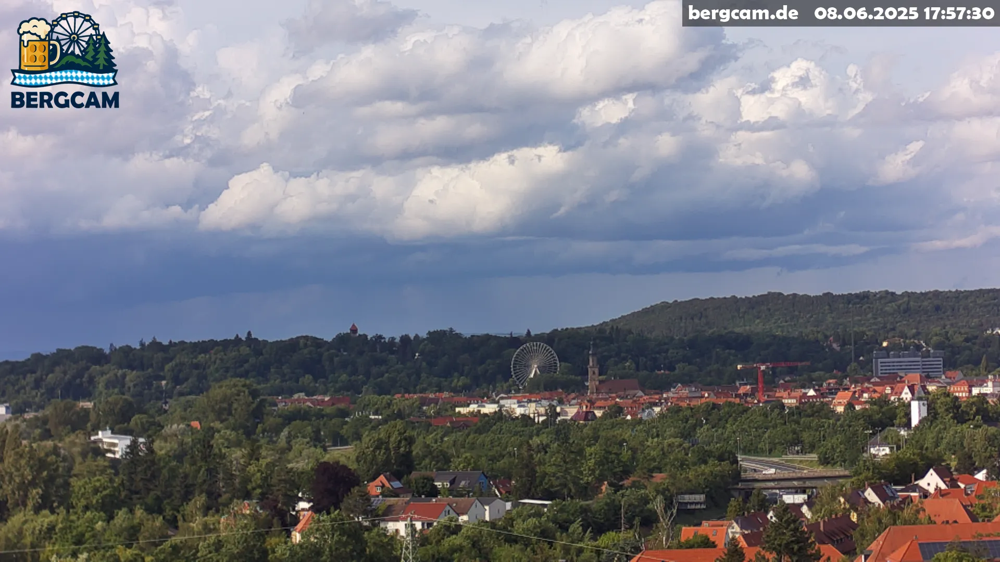

# Burgberg Webcam

The Bergcam captures a panoramic view of the Burgberg in Erlangen, Germany during the [Erlanger Bergkirchweih](https://www.visit-erlangen.de/bergkirchweih_erlangen/). A live view as well as older images are available at [https://bergcam.de]() (during the time of the Bergkirchweih).



Full Stack repository for a webcam exporting live images to a web frontend.
For the camera, a Raspberry Pi 5 with HQ Camera is used, it connects to an upload server software via a WireGuard tunnel.
The upload server is hosted together with the webserver and the image storage on a (virtual) Debian 12 machine.

## Installation
### 1. Build the frontend
Follow the instructions in [frontend/README.md]() to build the frontend.

### 2. Install the server software
Follow the instructions in [server/README.md]() to set up and install the server. It creates the WireGuard keys `server/camera.private` and `server/server.public`, which contents are required for the next step.

### 3. Create and flash the firmware
Follow the instructions in [firmware/README.md]() to build the firmware image. Use the keys `server/camera.private` and `server/server.public` to set up the WireGuard peer.

### 4. Test
Once started, the camera will establish a connection to the server using a WireGuard Tunnel. Test the connection:
```bash
# On the server:
$ wg # show connection details
$ ping 192.168.2.2 # check if the camera is reachable
# On the camera:
$ wg # show connection details
$ ping 192.168.2.1 # check if the server is reachable
```

The camera will capture a still image every 10 seconds (depending on configuration). Check:
```bash
$ systemctl status capture
$ journalctl -u capture -f
```

The server will receive the image with its `ingestor.py` script, which will write images to `/var/www/bergcam/captures` and `/opt/archive`. Check:
```bash
$ systemctl status ingestor
$ systemctl -u ingestor -f
```

## License
This project is licensed under the [GNU General Public License v3.0](LICENSE). For more details, see the `LICENSE` file or see https://www.gnu.org/licenses/.